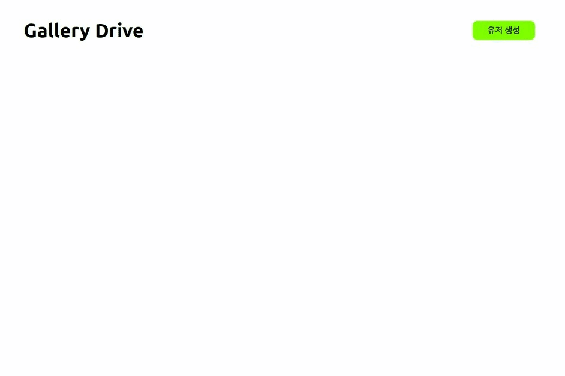

# Gallery Drive
> React, Redux Toolkit 으로 만든 랜덤 이미지 갤러리 드라이브

## 1. 제작 배경
- 팀 프로젝트를 진행하며 상태 관리 라이브러리를 사용해봤는데, 제대로 공부해서 사용해보고 싶어서 개발 진행

## 2. 개발 목표
- 랜덤 이미지를 만들고 폴더 구조로 저장하는 앱 개발
- RTK 및 RTK Query 연습
- 로딩 스켈레톤 및 로딩 스피너 UI 개발

## 3. 사용 기술
### main
- React
- TypeScript

### 전역 상태 관리
- Redux Toolkit (+Query)

### 린트 도구
- ESLint
- Prettier

### 스타일링
- SCSS

### 기타 라이브러리
- json-server : 간단한 API 서버 구축
- faker.js : 랜덤 텍스트, 이미지 제공

## 4. 결과물
### 4.1. 유저 CRUD 기능
- `로딩 스켈레톤` 및 버튼의 `로딩 스피너` 가 없는 경우 빠른 UI 업데이트가 가능합니다

### 4.2. 앨범 CRUD 기능
- `로딩 스켈레톤` 및 버튼의 `로딩 스피너` 를 위해 fetching을 의도적으로 `1초` 지연했습니다

### 4.3. 사진 생성 및 삭제 기능
- `로딩 스켈레톤` 및 버튼의 `로딩 스피너` 를 위해 fetching을 의도적으로 `1초` 지연했습니다

### 4.4. 캐싱
- 이미 fetching한 data는 caching합니다 (RTKQ의 tags 기능 활용)

